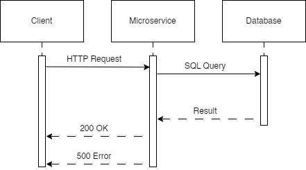

# Bookme Microservice

This is the microservice for Bookme, a service scheduling website.


## Schedule API
URL: localhost:3000/schedule

Schedule schema: 
~~~
    `servicId` int NOT NULL,
    `monday` tinyint(1) DEFAULT '0',
    `tuesday` tinyint(1) DEFAULT '0',
    `wednesday` tinyint(1) DEFAULT '0',
    `thursday` tinyint(1) DEFAULT '0',
    `friday` tinyint(1) DEFAULT '0',
    `saturday` tinyint(1) DEFAULT '0',
    `sunday` tinyint(1) DEFAULT '0',
    `startDate` date DEFAULT NULL,
    `endDate` date DEFAULT NULL,
    `startTime` time DEFAULT NULL,
    `endTime` time DEFAULT NULL,
    `timezone` varchar(10) DEFAULT NULL,
    PRIMARY KEY (`servicId`)
~~~
### GET Schedule
Send a GET request to localhost:3000/schedule

JS example
```javascript
let response = await fetch('http://localhost:3000/schedule')
```

**Response:** A JSON array of schedules:

```json
[
  {
    servicId: 112233,
    monday: 1,
    tuesday: 1,
    wednesday: 1,
    thursday: 1,
    friday: 0,
    saturday: 0,
    sunday: 0,
    startDate: '2023-09-12T07:00:00.000Z',
    endDate: '2023-09-14T07:00:00.000Z',
    startTime: '00:00:00',
    endTime: '23:59:59',
    timezone: 'PST'
  }
]
```
### POST Schedule

Send a POST request to the /schedule endpoint with the schedule json as the body: 

JS Example

```javascript
const scheduleRow = {
    "servicID": 112233,
    "monday": true,
    "tuesday": true,
    "wednesday": true,
    "thursday": true,
    "startDate": "2023-09-12",
    "endDate": "2023-09-14",
    "startTime": "00:00:00",
    "endTime": "23:59:59",
    "timezone": "PST"
}
let response = await fetch('http://localhost:3000/schedule', {
    method: 'POST',
    headers: {
        accept: 'application.json', 'Content-Type': 'application/json'
    },
    body: JSON.stringify(scheduleRow)
})
```

**Response:**: 200 OK if success and 500 Error + message otherwise

```json
{
    "message": "Duplicate entry '112233' for key 'schedule.PRIMARY'"
}
```
